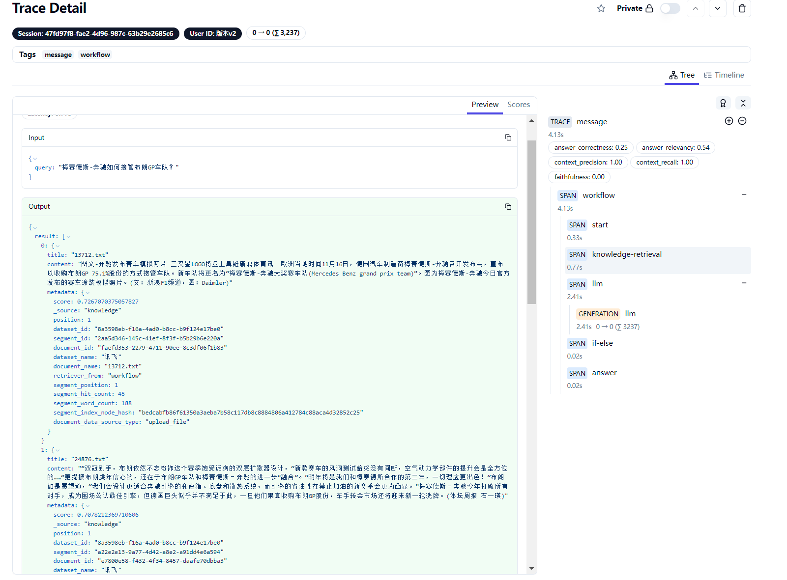
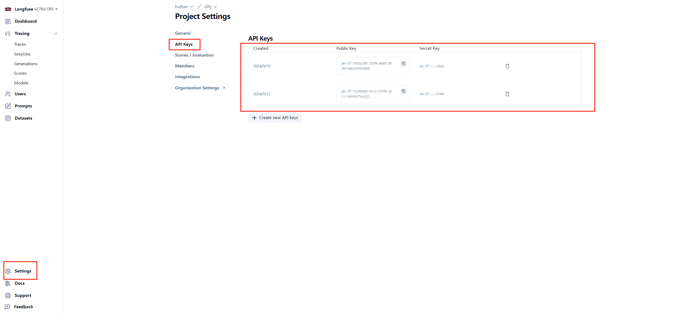
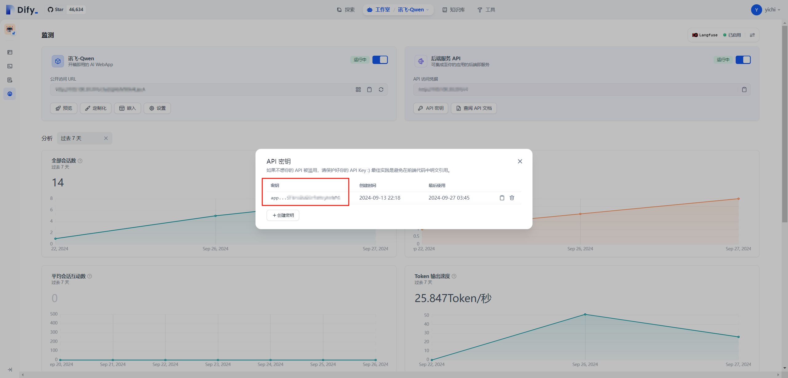

# Dify-Eval
基于 Dify + Langfuse + Ragas 的自动化评估与指标跟踪服务, 让 Dify 大模型应用的表现有迹可循。目前具备如下所示的功能：

1. 一键上传本地文件至 Langfuse 数据集;
2. 基于数据集批量自动化提交测试集至 Dify，并自动关联至测试数据集；
3. 全自动大模型评分，多维度，可拓展；
4. 多版本评分比较，可视化查看效果提升；

## 效果展示

**跟踪单次请求详细调用工作流**

**批量自动化评分**

**多版本效果比较**

## 使用流程

#### 初始化 Dify 和 Langfuse
1. 部署 Dify 和 Langfuse 应用， Dify 的部署可以参考 [Dify 文档](https://docs.dify.ai/v/zh-hans/getting-started/install-self-hosted/docker-compose)， Langfuse 的部署可以参考 [Langfuse 文档](https://langfuse.com/docs/deployment/local)。本框架理论上也支持 Dify 和 Langfuse 的云服务；
2. 在 Dify 中创建应用，并配置 Langfuse 跟踪，具体可以参考 [Dify 集成 Langfuse](https://docs.dify.ai/v/zh-hans/guides/monitoring/integrate-external-ops-tools/integrate-langfuse);

#### 初始化 Dify-Eval

1. 下载本项目 [Dify-Eval](https://github.com/hustyichi/dify-eval), 进入项目目录 dify-eval 下；
2. 并执行 `cp .env.example .env` 复制环境变量，根据实际情况修改 .env 中的环境变量；
3. 参考 `example.csv` 构建自己的测试数据集，也可以参考 `build.py` 自行修改构建测试数据集；
4. 执行 `poetry shell` 激活虚拟环境，然后执行 `poetry install` 安装所需的依赖；

**Langfuse Key 获取页面**

**Dify Key 获取页面**

**RAGAS 评估大模型与向量模型获取**
理论上支持 OpenAI 格式的路径和 API_KEY

实际测试时是基于 Xinference 离线部署的，流程基本类似

#### 自动化测试

1. 执行 `python run.py` 将本地的数据集上传至 Langfuse，并根据数据集自动提交任务至 Dify;
2. 执行 `python evaluate.py` 执行数据集的自动评分；

## 注意事项
1. 部分情况下可能没有正确答案，此时对应的数据集 `example.csv` 可以没有 `answer` 列, 完整的数据集构建和批量测试都是没问题的。但是没有正确答案的情况下进行评估部分 ragas 指标是无法支持的，需要有针对性调整；
2. 现有的默认指标都是在 `evaluate.py` 中的 `DEFAULT_METRICS` 定义的，可以根据实际情况进行修改；

